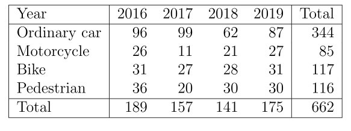
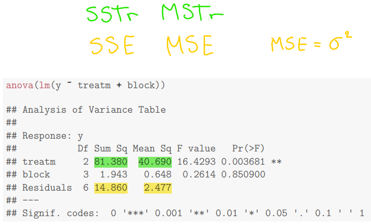
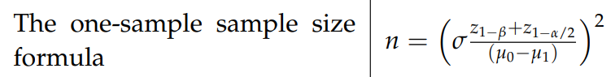
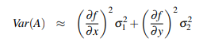
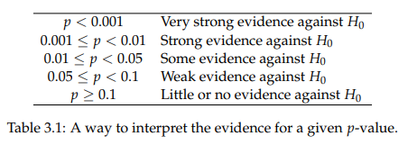
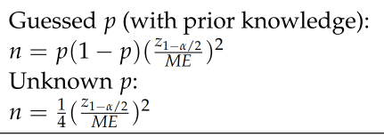

# Collective cheatsheet

## Hypotese

En null hypotese kan konkluderes afvist hvis en eller flere af nedstående tilgælde gælder:

1.  p-værdi er under alpha (eller nogen gange bare 0.1)
2.  test-statistik (t_obs) er ude af confidensintervallet. (critical value)?? (Måske)
3.  test-statistik (t_obs) er ude for qt(0.975, df=givet_df)
4.  confidensintervallet ikke indeholder den hypotetiske værdi.

## Binominal:

Getting x successes when pulling from n

```{r}
numberOfItems <- 10
success <- 1
prob <- 0.2

#Calculate the probability of x sucsess, when pulling n numberOfItems
#where the probability of sucsess is prob.

#Beregn sandsynligheden for x succeser, når der vælges n antal ting
#Og sandsynligheden for en succses er prob.

pbinom(success,numberOfItems,prob)
```

Getting **at least** x successes when pulling from n

```{r}
# getting at least x successes, when pulling from n
# with probablility of success = prob

numberOfItems <- 18+14
success <- 18
prob <- 0.5

1 - pbinom(success - 1 ,numberOfItems,prob)
```

Standard deviation (variance) and probability

```{r}
#Number of fails and successes
fail <- 14
success <- 18
x <- c(rep(0,fail), rep(1,success))

#get the standard deviation and variance
sd(x)
var(x)

#Given number of fails and successes
n <- fail + success
prob <- success/n

#get the probability of success
prob

```

## Hyper

Probability

```{r}
Type1Drawn <- 3
Type1All <- 3
Type2All <- 2
AllDrawn <- 3

#The probability of having drawn x Type1Drawn, in a draw of n AllDrawn.
#Where there are x of Type1All and x of Type2All to choose from.

dhyper(x=Type1Drawn, m=Type1All, n=Type2All, k=AllDrawn)

```

Variance

```{r}

#Calculate the variance given a probability (p) and number of participants (n)
n <- 25
p <- 0.8

#variance
n*p*(1-p)

```

**Example**

In a game of drawing marbles out of a bag, there are 10 marbles\
8 of them are green and will mean success; successes \<- 8\
2 of them are red and will mean fail; fails \<- 2

In total you draw 8 times without putting the marbles back in the bag (no replacement)\
drawn \<- 8\
You want to have 8 successes; wanted Successes = 8

What is the probability of this scenario playing out:

```{r}
successes  <- 8
fails <- 2

wantedSuccesses  <- 8
drawn <- 8

dhyper(wantedSuccsess, successes , fails, drawn)
```

## Poisson

## Proportion

Often uses Chi Squared for hyp-test\
But might also use Zobs\
{width="441"} Often uses Chi Squared for hyp-test.

Hvis der skal sammenliges to værdier bruges prop.test:

```{r}
prop.test(success, total, p=0.5,correct=FALSE)
```

Man skal ALTID bruge correct = FALSE. Aner ikke hvorfor. Her er {p} null hypotese værdien.

Prop.test

```{r}
#hmm needs explaining...
prop.test(x=c(171, 47), n=c(4675+171, 2040+47), correct=FALSE, conf.level=0.95)


#Test if the proportion will be half
prop.test(60, 114, p=0.5, correct=FALSE)
```

Expected number of x in sample y, under null hyp (no change)

```{r}
SumOfX <- 80
SumOfSample <- 63

SumOfAll <- 200


# expected 
(SumOfX*SumOfSample)/SumOfAll

```

 Using the data above calculate; Confidence interval for proportion

```{r}
#confidence interval for a proportion (or a chunk of proportions)
#Given
SumOfSample <- 84 + 63
SumOfAll <- 200

alpha <- 0.05

# pHat
pHat <- (SumOfSample)/SumOfAll

pHat + c(-1,1) * qnorm(1-alpha/2) *sqrt(pHat*(1-pHat)/SumOfAll)
```


```{r}

alpha <- 0.05

#pHat 1
SumOfX1 <- 35
SumOfSample1 <- 80
pHat1 <- (SumOfX1)/SumOfSample1

#pHat 2
SumOfX2 <-23
SumOfSample2 <- 90
pHat2 <- (SumOfX2)/SumOfSample2

#Estimate of the difference
SigmaHat <- sqrt(pHat1*(1-pHat1)/SumOfSample1+pHat2*(1-pHat2)/SumOfSample2)

pHat1-pHat2 + c(-1,1) * SigmaHat *qnorm(1-alpha/2)

```

### Calculate P-value (pvalue) for Chi squared

```{r}
tobs <- 10.985
#Number of columns
numCol <- 3
#Number of Rows
numRow <- 3
degreeFreedom <- (numCol-1)*(numRow-1)


#p value
1 - pchisq(tobs, df=degreeFreedom)

```

{width="398"}

### Confidence interval for a proportion (plus 2 method)

```{r}
n_success <- 27
n_success2 <- n_success + 2 # BLIVER KUN BRUGT VED +2 METODEN

# number of observations + 2 * all
n_failed <- 5
n_failed2 <- 5 + 2 # BLIVER KUN BRUGT VED +2 METODEN

n_total <- n_success + n_failed
n_total2 <- n_success2 + n_failed2

z <- qnorm(0.975)

p <- n_success / n_total      # Proportion
p2 <- n_success2 / n_total2   # Proportion  BLIVER KUN BRUGT VED +2 METODEN

#Conf interval
p+ c(-1,1)* z * sqrt((p*(1-p))/n_total)

#Conf interval med plus 2 metoden
p2+ c(-1,1)* z * sqrt((p2*(1-p2))/n_total2)


```

### Confidens interval mellem to værdier (difference between proportions)

Hvis der er givet to forskellige værdier og man skal finde confidensintervallet mellem forskellen på dem gøres det således: 

```{r}
p1 <- 35/80   # 35 er success, 80 er total
p2 <- 23/90   # 23 er success, 90 er total
p1-p2 + c(-1,1) * sqrt(p1*(1-p1)/80+p2*(1-p2)/90)*qnorm(0.975)
```

Use given numbers, indsæt egne tal vvvvvvvv

```{r}
alpha <- 0.05

#successes in each proportion
x1 <- 26
x2 <- 11

#total in each proportion
n1 <- 189
n2 <- 157

#calulate the proportions  
p1 <- x1/n1
p2 <- x2/n2

#CI
p1-p2 + c(-1,1) * sqrt(p1*(1-p1)/n1+p2*(1-p2)/n2)*qnorm(1-alpha/2)

```

a proportions contribution to the test statistic

```{r}
#the total for the column
ni <- 189

#the total for the row
nj <- 344
  
#the total of all
n <- 662

e <- ni*nj/n  


#the number in the cell (that proportion)
x <- 96
  
(e-x)^2/e
```

\

### test statistic (Treatment)

{width="368"} What is the usual test statistic for the test that the proportions of p1 and p2 are equal?

```{r}

#What is the usual test statistic for the test that the proportions of MM and NN are equal at
#UDP, i.e. H0 : pMM,UDP = pNN,UDP ?
x1 <- 17;
x2 <- 19;
x3 <- 15;

n1 <- n2 <- x1 + x2 + x3
p1 <- x1/n1
p2 <- x2/n2
(delta.p <- p2 - p1)

(phat <- (x1+x2)/(n1+n2))

(zobs <- delta.p / sqrt(phat*(1-phat)*(1/n1 + 1/n2)))

## The formula from the answer give the same answer
2/51/sqrt((6/17)*(11/17)*(2/51))

```

### test statistik (block)

Givet et datasæt som dette. Udregn Z test værdien for forskellen mellem 2016 og 2019 

```{r}
p1 <- (31+36)/189
p2 <- c(31+30)/175
p <- (31+36+31+30)/(189+175)
(z <- (p1-p2)/sqrt(p*(1-p)*(1/189+1/175)))
```

Husk at denne z værdi er god at sammenligne med 1.96 (ved 0.05 alpha). Hvis z \> 1.96 afvises null.

## Chi Squared

Degree of Freedom

```{r}
NumberOfRows <- 4
NumberOfColumns <- 3

degreeFreedom <- (NumberOfRows-1)*(NumberOfColumns-1)
degreeFreedom
```

Calculate P-value (pvalue) for Chi squared

```{r}
tobs <- 132.3
degreeFreedom <- 6


#p value
1 - pchisq(tobs, df=degreeFreedom)

```

```{r}
NumberOfRows <- 4
NumberOfColumns <- 3

degreeFreedom <- (NumberOfRows-1)*(NumberOfColumns-1)
degreeFreedom


#enter as columns
M <- as.table(cbind(c(4675,2222,2750,2040),c(171,95,49,47),c(76,1,2,1)))
M

chisq.test(M)

```

### Indlæsning af datasæt

{alt="Chisq test. aka X^2 test."}

Givet et datasæt som i billeded kan dataen indlæses således

```{r}
scores <- matrix(c(
  11, 27, 15, 
  14, 40, 30, 
  5, 23, 35
),ncol=3,byrow=TRUE)
colnames(scores) <- c("Below","Average","Above")
rownames(scores) <- c("Poor","Medium","Good")
scores

chisq.test(scores, correct=FALSE)


```

### contribution to test statistic

Hvad er contribution til test-statisstic for "celle navn"?

Det her er meget let at regne :) Det udregnes som:

```{r}
cell_value <- 10
row_total <- 129
column_total <- 76
all_total <- 1268

e <- row_total * column_total / all_total
(e - cell_value)^2 / e
```

## 

## One way Anova

### Fobs for one-way anova


```{r}
#number of observations
n <- 24

#number of treatments
k <- 4

#treatment
#sum of squares 
SSTr <- 2.286
#Degrees of freedom
dfTreat <- k-1
  
#residuals  
#sum of squares 
SSE <- 3.241
#Degrees of freedom
dfResidual <- n-k
  
  
MSTr <- SSTr/dfTreat

MSE <- SSE/dfResidual


(Fobs <- MSTr/MSE)


```

### Pvalue for one-way anova

```{r}
#Calculate Fobs, dfTreat and dfResidual above

1- pf(Fobs,dfTreat,dfResidual)

```

### Estimated effect alpha-hat

Estimated effect (symbol er alpha med en hat) forskellen mellem total mean og den speficikke treatment mean.

Eksempel hvor der finde alpha-hat_b:

```{r}
mean_a <- -1.2866667
mean_b <- -0.5416667
mean_c <- -1.1366667
mean_d <- -0.6816667
mean_b - mean(c(mean_a,mean_b,mean_c,mean_d))
### Her bliver det fundet alpha_b
```

### Post hoc pairwise confidens (difference in means)

Givet to grupper, hvad er confidensintervallet mellem deres forskel? Det udregnes som: 

Der bliver antaget her at MSE kendes. Se ovenover hvordan det udregenes.

```{r}
n <- 24
k <- 4
mean_1 <- -0.6816667
n_1 <- n/k # vil ofte bare være n / k
mean_2 <- -0.5416667
n_2 <- n/k # vil ofte bare være n / k
MSE <- 0.16207


alpha <- 0.05

t <- qt(1-alpha/2, df=n-k)

mean_1 - mean_2 + c(-1,1) * t * sqrt(MSE * (1/n_1 + 1/n_2))
```

### Standard deviation

standard deviation er lig sqrt(residual_MeanSq)

### Proportion of variance explained

Delen af variansen som kan blive forklaret af en model er lig

SStr / SST

Hvor SST er lig SSTr + SSE

## Two way Anova

Find the expected value of group1 at treat n

```{r}
#expected value of group1 at treat n
OverallAverage <- 0.523
TreatAverage <- 0.640
GroupAverage <- 0.479


#Expected
OverallAverage+(TreatAverage-OverallAverage)+(GroupAverage-OverallAverage)

```

Confidence interval, for the difference in mean value from group1 and group2 pre-planned 95% confidence interval

```{r}
TotalNumberOfSamples <- 16
NumberOfTreat <- 8
mean1 <- 0.479
mean2 <- 0.568
sd1 <- 0.077
sd2 <- 0.155

SSTr <- 0.179194
SSE <- 0.030644

MSTr <-  0.0255991
MSE <-  0.0043777

#Calculate qt
numberOfItems <- 1
degreeFreedom <- NumberOfTreat - numberOfItems
degreeFreedom
qt <- qt(0.975,degreeFreedom)
qt

#confidence interval
(mean1 - mean2) + c(-1,1)*qt *sqrt(MSE*2/NumberOfTreat)

```

#### pvalue, given a data set

```{r}
tab <- data.frame(clo=c(0.52,0.53,0.54,0.53,0.50,0.46,0.44,0.31,
0.76,0.71,0.68,0.64,0.50,0.51,0.43,0.31))
tab$temp <- as.factor(c(1,2,3,4,5,6,7,8,1,2,3,4,5,6,7,8))

anova(lm(clo ~temp,data=tab))


```

#### calculate p-value two way anova

```{r}
k <- 7; l <- 4; n <- 28; # Number of treatments k, number of partisipantc(Block) l, total number of observations n

SSTr <- 0.24902
SSE <-  0.32866

MSTr <-  0.041504
MSE <-   0.018259


df1 <- k - 1
print("Degree of freedom Treatmeant:")
df1

df2 <- (l-1)*(k-1)
print("Degree of freedom Risidual:")
df2


#Fobs 
Fobs <- (MSTr / MSE)
print("Fobs")
Fobs


#p-value
print("p-value")
1 - pf(Fobs,df1,df2)

```

### Find DF

Dette forhold gælder for degress of freedom i et two way anova.

k = antal treatments

DFTreatment = k -1

l = antal blocks

DFBLock = l - 1

DFResudial = (l-1)\*(k-1)

Total = n-1

n = k \* l

{width="450"}

SST = SSTr + SSE

## Exponential

### Find median ved givet mean

Der er helt sikkert en bedre måde at gøre det her, men det kan løses med simulation.

```{r}
mean <- 2.7017

n <- 1000
k <- 1000
data <- replicate(k,rexp(n,rate = 1/mean))
medians <- apply(data,2,median)
mean(medians)


#her er den bedre måde
?qexp
#quantile (median = 0.5)
quan <- 0.5
mean <- 2.7017

qexp(quan,1/mean)
```

## Simulation af sandsynlighed

Givet en normalfordeling, hvad er sandsynligheden for at et tal er over x?

Fks givet:\
mean = 20, sd= 5

Hvad er sansynligheden for at et givet tal er over 25?

Dette kan gøres med simulation hvis man ikke kan huske formlen

```{r}
n <- 10000
data <- rnorm(n,mean=20, sd=5)
stor = function(x) {
  x > 25
}
sum(sapply(data,stor)) / n

```

Her er stor en funktion som returnerer en boolean om tallet er større end 25. Ved at summe dem alle op tæller man hvor mange der er sande. Sandsynligheden er derfor antal sande / antal.

### Sum af sandsynlighed

Hvis der skal tages summen af to sandsynligheder, hvor de er normalfordelt kan man bare udregne den nye normalfordeling.

Givet en normalfordelint X og Y hvor:

X = N(20,5²)\
Y = N(50,10²)

Kan den nye normalfordeling hvor der er 1. af hver være:

NY = N(20+50, sqrt(5² + 10²)²)

NY = N(70,sqrt(125)²)

### Confidensintervaller i simulation

Hvis der skal findes et confidensinterval i simulationen kan det findes ved

```{r}
quantile(sort(data),c(0.025,0.975),type=2)
```

Hvor der i eksemplet bliver brugt alpha=0.05.

## Normal distribution


#### Calculate standard deviation (Normal distribution)

```{r}
#Given mean and a percentage within a range
Mean <- 100
Percentage <- 68
rangeLower <- 85
rangeUpper <- 115

## The quantile at range Lower
lowerQuan <- Mean/2-Percentage/2

## The lower quantile in the std. norm.
Z <- qnorm(lowerQuan/100)

#calculate Standard Deviation
sd <- (rangeLower-Mean)/Z
sd
```

Percentage of items above a value x

```{r}
#Given mean and sd
mean <- 100
sd <- 15

#percent of items above x
x <- 140
1 - pnorm(x, mean=mean, sd=sd)


#Given mean and a percentage within a range
Mean <- 100
Percentage <- 68
rangeLower <- 85
rangeUpper <- 115

## The quantile at range Lower
lowerQuan <- Mean/2-Percentage/2
lowerQuan
## The quantile at range upper
upperQuan <- Mean/2+Percentage/2
upperQuan

## The lower quantile in the std. norm.
Z <- qnorm(lowerQuan/100)

#calculate Standard Deviation
sd <- (rangeLower-Mean)/Z

#percent of items above x
x <- 140
1 - pnorm(x, mean=mean, sd=sd)
```

#### P-value (Normal distribution)

```{r}
n <- 50
tobs <- 0.857
df <- n -1


(1-(pt(tobs,df)))*2
```

## Confidence interval


#### One Sample mean (parametric/calculate)

normal distribution uses this one

```{r}
#One sample confidence interval mean
#number of observation in the sample
n <-10
mean <- 0
alpha <- 0.05
df <- n-1
sd <- 5

mean + c(-1,1)*qt((1-alpha/2),df = df ) * sd/sqrt(n)

```

 !!!!!!!! ADVARSEL VED IKKE OM DET VIRKER !!!!!!!!!!

```{r}
#sample size
n <- 10
#sd(x) standard deviation of x
s <- 2

alpha <- 0.05
df <- n-1


chi <- qchisq(1-alpha/2,df=df)
chi2 <- qchisq(alpha/2,df=df)

#Interval for Variance
c(((n-1)*s^2)/chi,((n-1)*s^2)/chi2)

#Interval for Standard deviation
c(sqrt(((n-1)*s^2)/chi),sqrt(((n-1)*s^2)/chi2))


```

Mean from confidence interval of mean

```{r}
lower <- 2.26
upper <- 5.26
  
#Calculate the mean from a lower and an upper bound of a confidence interval of the mean
(lower+upper)/2
#Note you cannot know the sample mean from simulated data

```

#### Mean (parametric/calculate)

Calculate confidence for mean interval (??? distribution)

```{r}
n <- 16
mean <- 0.5
sd <- 0
standardError <- 0.0043777

#Calculate qt
numberOfItems <- 1
degreeFreedom <- n - numberOfItems

qt <- qt(0.975,degreeFreedom)
qt


#confidence interval
mean + c(-1,1)* qt * sd/sqrt(n)
mean + c(-1,1)* qt * standardError

#Given qt 
qt <- 0

mean + c(-1,1)* qt * sd/sqrt(n)
mean + c(-1,1)* qt * standardError

```

#### Mean (data set)

Confidence interval for mean on a data set

```{r}
#given a data set
x <- c(10.5, 9.3, 10.7, 10.8, 11.2)

# remember the alpha
alpha <- 0.1
qt <- qt((1-alpha/2),length(x)-1)
mean(x) + c(-1,1)* qt * sd(x)/sqrt(length(x))

#or use t.test remember the conf.level aka alpha
t.test(x,conf.level=0.9)

```

#### Varians / sd (data set)

For at regne et konfidensinterval af en varians af noget data skal der bruges:\
Confidence interval for variance on a data set

```{r}
my_df = 9
qchisq(0.025,df=my_df)
# og 
qchisq(0.975, df=my_df)
```

## Linear Simulation

Variance

```{r}
#Simulate to get variance, normal distribution
#given 2*Y + 2*X + 4

k <- 800000

MeanX <- 10
SdX <- sqrt(4)

MeanY <- 20
SdY <- sqrt(25)

X <- rnorm(k,MeanX,SdX)
Y <- rnorm(k,MeanY,SdY)

z <- 2* Y + 2*X +4

var(z)
```

Standard Divination

```{r}
#Simulate to get Standard Divination, normal distribution
#given 2*Y^2 + X^3/3

k <- 800000

MeanX <- 10
SdX <- sqrt(4)

MeanY <- 20
SdY <- sqrt(25)

X <- rnorm(k,MeanX,SdX)
Y <- rnorm(k,MeanY,SdY)

z <- 2*Y^2 + X^3/3

sd(z)
```

## test statistic

Calculate tobs

```{r}
#Given n number of samples
#Given the actual mean or something similar
#Compared to the expected mean or something similar

n <- 20
actual <- 0
expected <- 0

# given standard deviation
sd <- -1
#beregn t_obs (tobs)
(actual - expected)/(sd/sqrt(n))


# given standard error
standardError <- 5.867*10^4
#beregn t_obs (tobs)
(actual - expected)/(standardError)


```

Calculate tobs given two data sets

```{r}
#given a two data sets x and y
x <- c(10.5, 9.3, 10.7, 10.8, 11.2)
y <- c(8.9, 9.5, 10.2, 9.8, 10.3)

t.test(x,y)
t.test(x, y, paired = TRUE, conf.level = 0.95)
#find: t = ...
```

tobs on a certain p-value

```{r}
NumberOfSamples <- 20
degreeFreedom <- NumberOfSamples-1
pValue <- 0.001

qt(1-pValue/2,degreeFreedom)
qt(pValue/2,degreeFreedom)


```

### Power t.test

Two sample

```{r}
#pooled variance
x <- c(10.5, 9.3, 10.7, 10.8, 11.2)
y <- c(8.9, 9.5, 10.2, 9.8, 10.3)
n1 <- length(x)
n2 <- length(y)
VarPooled <- ((n1-1)*var(x)+(n2-1)*var(y)) / (n1+n2-2)

#minimum number of observations / samples
power.t.test(delta=1,sd = sqrt(VarPooled),sig.level = 0.01,power=0.99)


```

One sample

Number of samples n 

```{r}
power <- 0.8
sd <- 1.5
meanDif <- 0.3
alpha <- 0.05

#number of needed samples (n)
(sd*(qnorm(1-alpha/2)+qnorm(power))/meanDif)^2

```

GIvet en power, afvigelse fra mean, sd og signifikantniveau kan den nødvendige n findes ved:

```{r}

power.t.test(power = 0.9, delta = 0.05, sd = 0.11,
sig.level = 0.01, type = "one.sample")

```

### Hvad power i virkeligheden er

Power defineres som:\
Sandsynligheden for at lave en type 2 error er lig 1-power

En type 1 error er at afvise null mens null er sand\
En type 2 error er at acceptere null mens null er falsk.

Det betyder at høj power lig lav sandsynlighed for at lave fejl. Større n giver også mere power.

### Fobs (one way)

```{r}
k <- 8; n <- 0 # Number of treatments k, total number of observations n

SSTr <- 0.179194
SSE <-  0.030644

MSTr <- 0.0315062
MSE <-  0.0043777

degreeFreedomTreatment <- k - 1
print("Degree of freedom:")
degreeFreedomTreatment


Fobs <- (MSTr / MSE)
print("Fobs")
Fobs


Fobs <- (SSTr/(k-1)) / (SSE/(n-k))
print("Fobs")
Fobs

```

## Linear Model:

I en linear model af

```{r}
lm(X ~ Y)
```

Gælder det at: X er dependent variable Y er explanatory variable

Beta_0 er (Intecept) estimate\
Beta_1 er Y\
Estimate sigma er residual standard error.

Predictions ved x_0 udregnes som:

```{r}
sxx <- (n-1) * var(Y)
t_alpha <- qt(0.95, df=n-2) #alpha = 0.9
beta_0 + beta_1 * x_0 + c(-1,1) * t_alpha * res_err * sqrt(1+1/n + (x_0-mean(x)/ sxx))
```

 I model Y = beta0 + beta1 \* x + residuals

Her er Sxx = (n-1) \* var(Y)

### Multiple R squared

Multiple R squared er en skalar fra 0-\>1 som beskriver hvor meget af variansen som modellem forklarer.

Eksempel:

Multiple R squared = 0.22 -\> 22% af variansen kan forklares af modellen.

### Confidence interval for beta_i

```{r}
n <- 20
bHat <- 23.25

#residual error
sigmaHat <- 1.74

# lidt i tvivl om degrees of freedom
df <- n - 2

bHat + c(-1,1)* qt(0.975,df)*sigmaHat


#givet et fit
x <- c(rnorm(20, mean=5, sd=5))
y <- c(rnorm(20, mean=2, sd=5))

fit <- lm( y~x )
confint(fit,level=0.95)


```

## Quantile

DER SKAL ALTID BRUGES TYPE 2 QUANTILE I ALLE OPGAVER DET ER RET KLAMT!!

```{r}
data <- c(1,2,3)
quantile(data,0.8,type=2)
```

Her tages der 80% kvantil

### Inter quantile range

Inter quantile range defineres som Q3 - Q1

## Welch T.test

v degrees of freedom

```{r}
#v degrees of freedom

n1 <- 50
n2 <- 50

s1 <- 467.9
s2 <- 409

b1 <- s1^2/n1
b2 <- s2^2/n2

v <- (b1+b2)^2/((b1)^2/(n1-1)+(b2)^2/(n2-1))

v

```

## Variation

### Coefficient of variation

Definitionen på ciefficient of variation er sd/mean

## Propogation of error

Propogation of error er mega klamt od udregenses således: {width="417"} Der kan ofte findes det rigtige resultat ved at det her finder varians, og der skal ofte findes sd. Derfor skal der tages sqrt af resultatet.

## P-value (pvalue)



## Margin of error

Hvis der er givet en proportion (p) og en margin of error (ME). Kan n udregnes ved:



Hvis ikke dette kan bruges kan der søges efter "ME" (med store bogstaver) i formelsamlingen.
